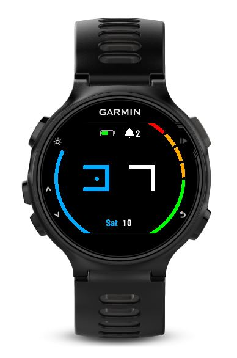
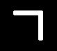
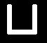

# Garmin Watchface

This project creates a watch face using a base-12 hour and minute notation.

Features:
- Base 12 hour and minute notation
- Alarm (icon for one alarm, number for more than one alarm)
- Battery
- Steps as part of goal
- Move indicator
- Day of week and day of month

### Explanation of base-12 notation

The numbers:

0-2

3-5

6-8

9-11

##### Hour

The hour notation is two times 12 hours. The first twelve hours are the values 0-11 (base 10), while the last 
12 hours have a dot inside the number.

##### Minute

The minute notation increases the value every five minutes. Every minute a dot is added. First on top, then on
the right, then on the bottom and finally on the left.

#### Example

The screenshot shows a time of 14:22 in decimal time. (2 hours after 12 o'clock, and 4×5 + 2 minutes).