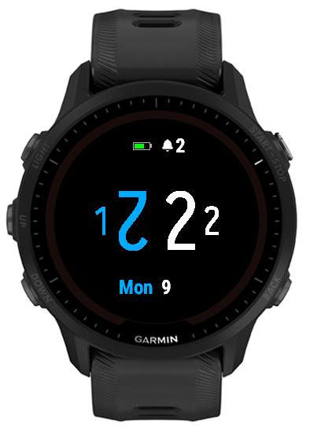

# Garmin Watch face

This project creates a watch face using a base-12 hour and minute notation.

Features:
- Base 12 hour and minute notation
- Alarm (icon for one alarm, number for more than one alarm)
- Battery
- Steps as part of goal
- Move indicator
- Day of week and day of month

The colors of all the parts of the watch face can be configured individually. Also, some elements can be removed
from the watch face.

### Explanation of base-12 notation

The numbers from 0 to 9 are the same as in the decimal (base-10) notation.

The decimal numbers 10 and 11 are represented with the runic characters ᛋ and ᚩ.

##### Hour

The hour notation is two times 12 hours. The first twelve hours are the values 0-11 (base 10) and are preceded with a 0. The last 
12 hours are preceded by a 1.

##### Minute

The minute notation increases the value every five minutes. Every minute the postfix is increased by one.

#### Example

The screenshot above shows a time of 23:44 in decimal time. (11 hours after 12 o'clock, and 8×5 + 4 minutes).

Also, 2 alarms are set, around 70% of the step goal has been reached and the move alert is at level 5.